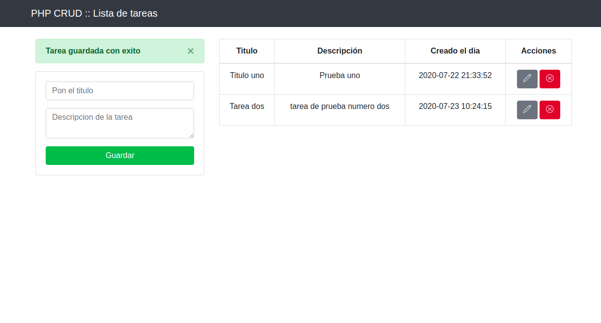

# PHP_Tareas_CRUD
Una aplicación sencilla para crear y editar tareas en PHP, HTML5, BOOTSTRAP4 y MySQL

En el archivo **db.php** se deben agregar los datos de conexion para la base de tados

Una aplicación sencilla para crear y editar tareas en PHP, HTML5, BOOTSTRAP4 y MySQL
